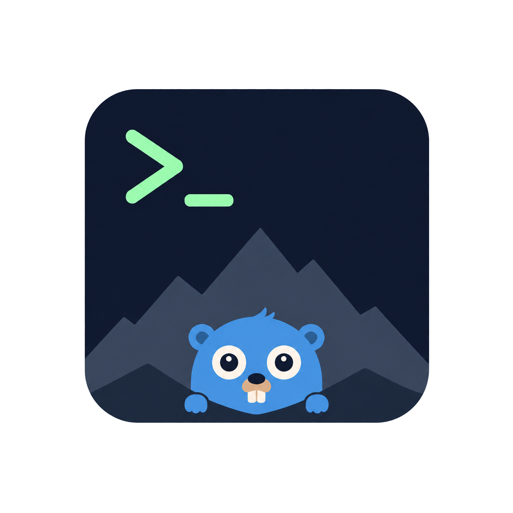

<p align="center">
  
</p>

<p align="center">
  <a href="https://github.com/leodeim/colimui/actions/workflows/build.yml"></a>
  <a href="https://github.com/leodeim/colimui/releases/latest"></a>
  <a href="https://github.com/leodeim/colimui/releases"></a>
  <a href="https://github.com/leodeim/colimui/blob/main/LICENSE"></a>
</p>

# colimUI

A small terminal UI app for `colima` and `docker`.

## Install

The installer supports macOS and Linux on Intel/AMD and ARM CPUs. It downloads binary, verifies its checksum, and installs to `/usr/local/bin`.

```sh
curl -fsSL https://raw.githubusercontent.com/leodeim/colimui/main/scripts/install.sh | sh
```

### Run

```sh
colimui
```

### Update

```sh
colimui update
```

### Install using Go:

```sh
go install github.com/leodeim/colimui@latest
```

## Keys

| Key | Action |
| --- | --- |
| `?` | Open or close the Actions menu |
| `↑` / `↓` or `k` / `j` | Select a container or menu item |
| `Tab`, `←`, `→` | Switch focus between containers and logs |
| `Enter` | Start/stop the selected container, expand/collapse a Compose group, or run the selected menu action |
| `/` | Search containers |
| `R` (`Shift+R`) | Toggle running containers only |
| `Esc` | Clear filters; while searching, cancel editing; in a menu, close it |
| `r` | Refresh profiles and containers |
| `[` / `]` | Switch to the previous/next Colima profile |
| `s` / `x` | Start/stop the current Colima profile |
| `t` | Restart the selected container |
| `d` | Open deletion confirmation for a stopped container |
| `y` / `n` | Confirm/cancel deletion |
| `l` | Reload the selected container's logs |
| `f` | Toggle following logs |
| `Home` | Load log history from the start, subject to retention limits |
| `Page Up` / `Page Down` | Scroll logs |
| `End` | Jump to the latest logs |
| `q` | Quit, or close the current menu |
| `Ctrl+C` | Quit from any mode |


## New Mac setup

```sh
bash scripts/setup-mac.sh
```

Installs Homebrew if needed, then Colima, Docker, and Docker Compose. Configures
`docker compose`, starts the default Colima profile, selects its Docker context,
and checks the engine connection. Supports Apple Silicon and Intel Macs and can
be rerun. Existing Compose plugins are backed up before replacement.

References: [Homebrew installation](https://docs.brew.sh/Installation),
[Colima installation](https://colima.run/docs/installation/),
[Compose Homebrew package](https://formulae.brew.sh/formula/docker-compose).
